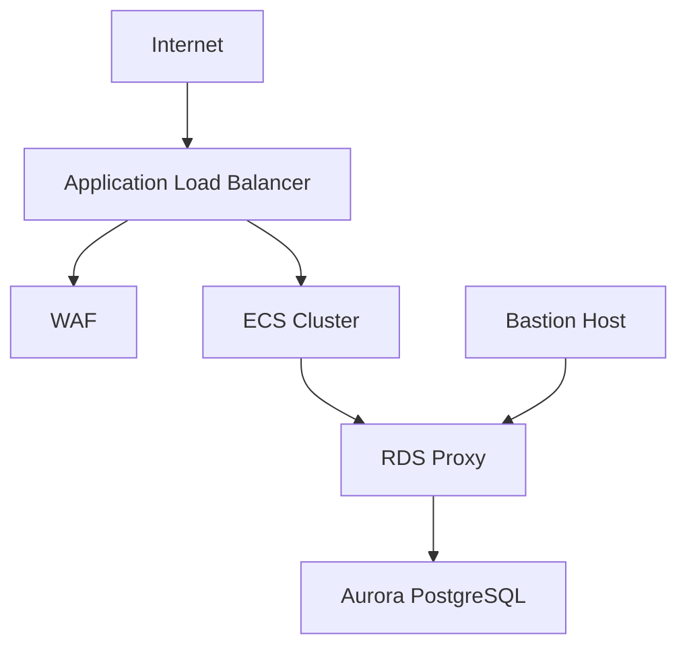

# AWS Infrastructure as Code Repository

This repository contains CloudFormation templates for deploying a scalable, secure AWS infrastructure including ECS, Aurora PostgreSQL, and associated services.

## Repository Structure

```
.
├── api/
│   ├── backend-stack.yaml        # Main infrastructure stack
│   └── backend-stack-with-rds.yaml  # Legacy RDS stack (deprecated)
├── etl-lambda/
│   └── template.yml             # ETL Lambda infrastructure
└── README.md
```

## Infrastructure Components

### Core Infrastructure
- VPC with public and private subnets across multiple AZs
- Internet Gateway and routing configuration
- Application Load Balancer (ALB) with HTTPS support
- WAF configuration for ALB protection
- S3 buckets for ALB logs and API storage

### Database
- Aurora PostgreSQL Serverless v2
- RDS Proxy for connection pooling
- Enhanced monitoring and performance insights
- Automated backups and encryption

### Compute
- ECS Cluster with EC2 capacity providers
- Auto Scaling configuration
- Spot Instance support (optional)
- Bastion host for secure access

### Security
- Security Groups for all components
- SSL/TLS termination at ALB
- WAF rules for application protection
- Private subnets for sensitive resources
- Secrets management for database credentials

## Prerequisites

- AWS CLI installed and configured
- Appropriate AWS permissions
- SSL/TLS certificate in AWS Certificate Manager
- SSH key pair for EC2 instances

## Deployment Parameters

Key parameters that need to be configured:

- `MyProjectName`: Name of your project
- `Environment`: Deployment environment (dev/staging/prod)
- `MyIPAddress`: IP address for SSH access
- `CertificateArn`: SSL certificate ARN
- `RDSInstanceType`: Aurora capacity range (ACUs)
- Database credentials:
  - `MyDatabaseName`
  - `MyDatabaseUser`
  - `MyDatabasePassword`

## Deployment Instructions

1. Create a parameters file:

```json
[
  {
    "ParameterKey": "MyProjectName",
    "ParameterValue": "your-project-name"
  },
  // ... other parameters
]
```

2. Deploy the stack:
```bash
aws cloudformation create-stack \
  --stack-name your-stack-name \
  --template-body file://api/backend-stack.yaml \
  --parameters file://parameters.json \
  --capabilities CAPABILITY_NAMED_IAM
```

## Infrastructure Diagram



## Monitoring and Maintenance

The infrastructure includes:
- CloudWatch alarms for CPU utilization
- RDS Enhanced Monitoring
- Performance Insights for database
- ALB access logs
- Container Insights for ECS

## Cost Optimization

- Aurora Serverless v2 for cost-effective database scaling
- Optional Spot Instance support for ECS
- S3 lifecycle policies for log management
- Auto-scaling based on demand

## Security Considerations

1. Database access is restricted to:
   - ECS tasks through RDS Proxy
   - Bastion host for administrative access

2. Network security:
   - Private subnets for sensitive resources
   - Security groups with minimal access
   - WAF rules for ALB protection

3. Encryption:
   - TLS for all external connections
   - Storage encryption for RDS
   - S3 bucket encryption

