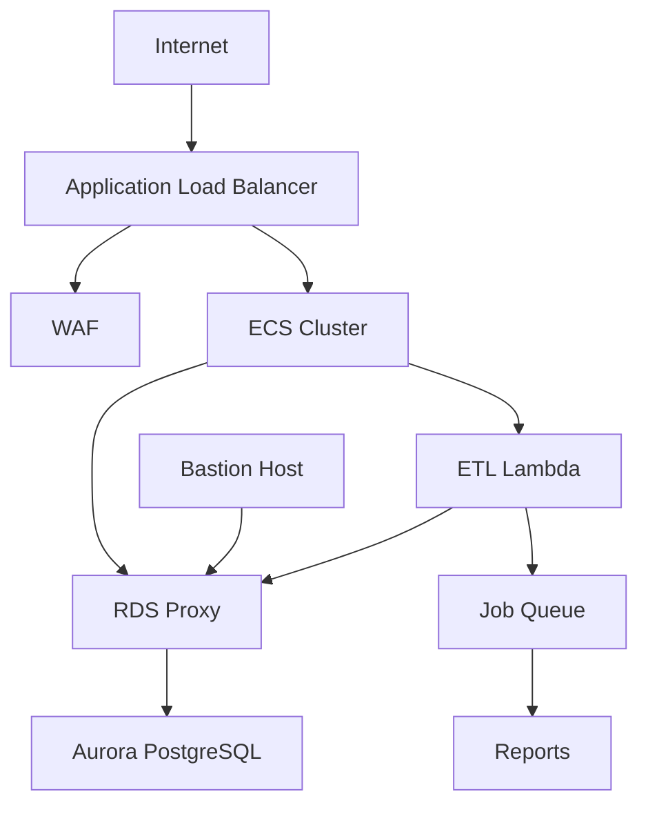

# AWS Infrastructure as Code Repository

This repository contains CloudFormation templates for deploying a scalable, secure AWS infrastructure including ECS, Aurora PostgreSQL, and associated services.

## Repository Structure

```
.
├── backend/
│   ├── backend-stack.yaml        # Main infrastructure stack with Aurora Serverless v2
│   ├── backend-stack-with-rds.yaml  # Infrastructure stack with RDS instance
│   ├── params.json               # Parameters for main infrastructure stack
│   └── params-with-rds.json      # Parameters for infrastructure stack with RDS instance
├── etl-lambda/
│   ├── build-layer.sh            # Script to build Lambda layer
│   ├── create-bucket.sh          # Script to create S3 buckets
│   ├── deploy.sh                 # Script to deploy Lambda function
│   └── template.yml              # ETL Lambda infrastructure
└── README.md
```

## Infrastructure Components

### Core Infrastructure
- VPC with public and private subnets across multiple AZs
- Internet Gateway and routing configuration
- Application Load Balancer (ALB) with HTTPS support
- WAF configuration for ALB protection
- S3 buckets for ALB logs and API storage

### Database
- Aurora PostgreSQL Serverless v2 (main stack)
- RDS instance (legacy stack)
- RDS Proxy for connection pooling
- Enhanced monitoring and performance insights
- Automated backups and encryption

### Compute
- ECS Cluster with EC2 capacity providers
- Auto Scaling configuration
- Spot Instance support (optional)
- Bastion host for secure access
- Lambda for ETL process

### Integration
- SQS queue for job processing
- SQS deadletter queue for messages that can't be processed successfully

### Security
- Security Groups for all components
- SSL/TLS termination at ALB
- WAF rules for application protection
- Private subnets for sensitive resources
- Secrets management for database credentials
- SSH key pair for EC2 instances

## Prerequisites

- AWS CLI installed and configured
- Appropriate AWS permissions
- SSL/TLS certificate in AWS Certificate Manager

## Deployment Parameters

Key parameters that need to be configured:

- `MyProjectName`: Name of your project
- `Environment`: Deployment environment (dev/staging/prod)
- `MyIPAddress`: Whitelisted IP address for SSH access
- `CertificateArn`: SSL certificate ARN (if using HTTPS)
- `RDSInstanceType`: Aurora capacity range (ACUs) or RDS instance type
- Database credentials:
  - `MyDatabaseName`
  - `MyDatabaseUser`
  - `MyDatabasePassword`

## Deployment Instructions

1. Create a parameters file:

```json
[
  {
    "ParameterKey": "MyProjectName",
    "ParameterValue": "your-project-name"
  },
  // ... other parameters
]
```

2. Deploy the stack:
### Deploy main backend stack
```bash
aws cloudformation create-stack \
  --stack-name your-stack-name \
  --template-body file://backend/backend-stack.yaml \
  --parameters file://backend/params.json \
  --capabilities CAPABILITY_IAM CAPABILITY_NAMED_IAM
```

### Deploy ETL Lambda functions

```bash
# Make shell files executable
sudo chmod +x deploy.sh build-layer.sh create-bucket.sh

# Create artifacts and files bucket
sudo ./etl-lambda/create-bucket.sh

# Build library dependencies for python
sudo ./etl-lambda/build-layer.sh

# Deploy lambda functions dependencies
sudo ./etl-lambda/deploy.sh
```

## Testing

### Create a change set without executing it for Main Stack with Aurora Serverless v2
```bash
aws cloudformation create-change-set \
  --stack-name capstone-grupo-2 \
  --template-body file://backend/backend-stack.yaml \
  --parameters file://backend/params.json \
  --capabilities CAPABILITY_IAM CAPABILITY_NAMED_IAM \
  --change-set-name validation-test \
  --change-set-type CREATE
```

### Main Stack with RDS
```bash
aws cloudformation create-change-set \
  --stack-name capstone-grupo-2-with-rds \
  --template-body file://backend/backend-stack-with-rds.yaml \
  --parameters file://backend/params-with-rds.json \
  --capabilities CAPABILITY_IAM CAPABILITY_NAMED_IAM \
  --change-set-name validation-test-with-rds \
  --change-set-type CREATE
```

## Infrastructure Diagram



## Monitoring and Maintenance

The infrastructure includes:
- CloudWatch alarms for CPU utilization
- RDS Enhanced Monitoring
- Performance Insights for database
- ALB access logs
- Container Insights for ECS

## Cost Optimization

- Aurora Serverless v2 for cost-effective database scaling
- Optional Spot Instance support for ECS
- S3 lifecycle policies for log management
- Auto-scaling based on demand

## Security Considerations

1. Database access is restricted to:
   - ECS tasks through RDS Proxy
   - Bastion host for administrative access

2. Network security:
   - Private subnets for sensitive resources
   - Security groups with minimal access
   - WAF rules for ALB protection

3. Encryption:
   - TLS for all external connections
   - Storage encryption for RDS
   - S3 bucket encryption

